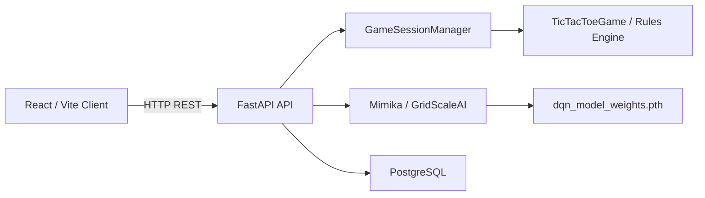

# HexTacTic

**HexTacTic** is a full-stack 6×6 Tic-Tac-Toe application built around a server-authoritative game engine, a React/Vite client, a FastAPI REST API, persistent PostgreSQL player statistics, and an optional AI opponent powered by the **Mimika** reinforcement-learning subsystem.

The application separates presentation, game-state management, AI inference, and persistence so that the browser remains a client of the game service rather than the authority over game state.

> **Scope:** This document covers the HexTacTic web application and its runtime architecture.  
> AI internals are documented in `Mimika_README.md`. Database internals are documented in `Database_README.md`.

---

## Architecture



The repository places the frontend in `tic-tac-toe-front/`, while the FastAPI application remains at the project root. The frontend's Vite configuration uses `concurrently` to launch the frontend and backend development processes together.

---

## Core Design Principles

### Server-authoritative game state

The browser renders state returned by the backend. Move validation, turn management, score computation, winner detection, session management, and AI turns are performed server-side.

This prevents the client from being the source of truth for the game.

### Session-based runtime state

Active games are represented by UUID-backed sessions managed by `GameSessionManager`. Sessions are kept in memory and protected by a re-entrant lock. Expired sessions are removed according to `SESSION_TTL_SECONDS`.

### Separate persistence from gameplay

Live game state is transient and held by the session manager. Long-lived player statistics are stored in PostgreSQL through `database.py`.

### AI as an inference service

The API does not contain the neural network implementation. It delegates AI decisions to `GridScaleAI`, which loads Mimika's trained weights and exposes a small inference interface.

---

## Runtime Components

| Component | Location | Responsibility |
|---|---|---|
| React client | `tic-tac-toe-front/src/` | UI, user interaction, state rendering |
| FastAPI application | `app.py` | REST API and application lifecycle |
| Session manager | `game_sessions.py` | Active game sessions and TTL handling |
| Rules engine | `script.py` | Board validation, turns, scoring and win/tie detection |
| AI service | `mimika/ai_service.py` | Model loading and move inference |
| Board encoding | `mimika/board_encoding.py` | Converts game state into model input |
| Database layer | `database.py` | PostgreSQL pooling, migrations and player statistics |
| Configuration | `settings.py` | Environment-driven runtime configuration |
| Migrations | `migrations/` | PostgreSQL schema evolution |
| Model artifact | `mimika/dqn_model_weights.pth` | Trained Mimika parameters |

---

## Game Lifecycle

### 1. Application startup

FastAPI's lifespan handler:

1. Initializes the PostgreSQL layer with `init_db()`.
2. Instantiates `GridScaleAI`.
3. Loads the configured model weights into memory.
4. Keeps the AI instance available for subsequent requests.
5. Closes the PostgreSQL connection pool during application shutdown.

### 2. Starting a game

`POST /api/start` accepts:

```json
{
  "mode": "vs_player",
  "difficulty": "Normal",
  "starting_player": "X"
}
```

Supported modes are:

- `vs_player`
- `vs_system`

Supported difficulties are:

- `Easy`
- `Normal`
- `Hard`
- `Nightmare`

The backend normalizes `"Medium"` to `"Normal"` and rejects unsupported difficulty values.

A UUID session is created and the initial serialized state is returned.

### 3. Processing a move

`POST /api/move`:

1. Resolves the active session.
2. Validates the requested row and column.
3. Applies the move through `TicTacToeGame`.
4. Returns the resulting state if the game has ended.
5. Otherwise, invokes Mimika when the session is a system game and the turn changes to the AI.

### 4. AI response

For an AI turn, the backend:

1. Reads the current board.
2. Computes valid flattened board indices.
3. Calls `GridScaleAI.get_best_move(...)`.
4. Converts the returned action index into `(row, col)`.
5. Applies the AI move through the same rules engine used for human moves.

### 5. Match persistence

When a system match ends, the frontend sends the result to:

```text
POST /api/record-match
```

The backend validates the result and difficulty before delegating persistence to PostgreSQL.

---

## API Surface

| Method | Endpoint | Purpose |
|---|---|---|
| `GET` | `/health` | Service, database and AI readiness information |
| `GET` | `/api/state` | Retrieve an active session state |
| `POST` | `/api/start` | Create a new game session |
| `POST` | `/api/move` | Submit a board move |
| `GET` | `/api/player/{username}` | Retrieve player statistics |
| `POST` | `/api/record-match` | Persist a completed match result |

The API also applies request rate limiting through `slowapi`.

In production mode, the backend can require an `X-API-Key` header. CORS origins, rate limits, runtime mode and database settings are controlled through environment configuration.

---

## Frontend

The client is a React 19 application bundled with Vite.

The frontend is responsible for:

- Game configuration.
- Username collection.
- Board rendering.
- Current-player display.
- Score and winner highlighting.
- Difficulty selection.
- Player-vs-player and player-vs-system modes.
- Fetching player statistics.
- Synchronizing backend game state with React state.

The frontend package defines development commands for launching Vite and the FastAPI backend concurrently.

### Frontend stack

- React
- React DOM
- Vite
- ESLint
- `concurrently`

---

## Backend

HexTacTic uses FastAPI as the service boundary.

Important backend responsibilities include:

- Request validation through Pydantic.
- CORS configuration.
- API-key enforcement in production mode.
- Rate limiting.
- Game-session lookup and expiration handling.
- Game-rule delegation.
- AI inference delegation.
- Database access.
- Health reporting.
- Controlled production error responses.

The API is intentionally thin around the rules and model layers: `app.py` coordinates the subsystems rather than implementing the board algorithm or neural network itself.

---

## Game Engine

`script.py` contains the `TicTacToeGame` implementation.

The current implementation uses:

- A 6×6 board.
- `X` and `O` markers.
- Four directional scans:
  - horizontal
  - vertical
  - diagonal down-right
  - diagonal down-left
- Incremental score-combination detection.
- A score threshold of **3** for declaring a winner.
- Full-board detection for ties.

> **Implementation note:** Earlier project diagrams/readmes describe the game as a 5-in-a-row variant. The current `script.py` implementation actually declares a winner when a player reaches a score of 3, with three-cell combinations contributing points. The executable rules implementation should therefore be treated as authoritative unless the game rules are intentionally changed.

---

## Configuration

Runtime settings are centralized in `settings.py`.

Important variables include:

```text
RUNTIME_MODE
API_HOST
API_PORT
DB_NAME
DB_USER
DB_PASSWORD
DB_HOST
DB_PORT
DB_CONNECT_TIMEOUT
DB_POOL_MIN
DB_POOL_MAX
MODEL_PATH
CORS_ORIGINS
API_KEY
RATE_LIMIT
SESSION_TTL_SECONDS
```

The application can load values from a local `.env` file.

The model path defaults to:

```text
mimika/dqn_model_weights.pth
```

and falls back to:

```text
saved_models/dqn_model_weights.pth
```

if the default artifact is unavailable.

---

## Installation

### Prerequisites

- Python 3.10+
- Node.js
- npm
- PostgreSQL
- PyTorch and the Python dependencies required by the backend
- A trained Mimika weight file for AI gameplay

### Backend environment

Create a `.env` file in the repository root and configure the PostgreSQL credentials.

Example:

```env
DB_NAME=postgres
DB_USER=postgres
DB_PASSWORD=your_password
DB_HOST=127.0.0.1
DB_PORT=5432

RUNTIME_MODE=development
API_PORT=8000
```

### Install frontend dependencies

```bash
cd tic-tac-toe-front
npm install
```

### Run development environment

From the frontend directory:

```bash
npm run dev
```

The repository's frontend package launches:

- Vite for the React client.
- Uvicorn for the FastAPI backend.

---

## Repository Structure

```text
python_tictactoe/
├── app.py
├── database.py
├── game_sessions.py
├── script.py
├── settings.py
├── migrations/
│   ├── 001_initial.sql
│   └── 002_backfill_highest_difficulty.sql
├── mimika/
│   ├── __init__.py
│   ├── agent.py
│   ├── ai_service.py
│   ├── board_encoding.py
│   ├── config.py
│   ├── model.py
│   ├── trainer.py
│   └── dqn_model_weights.pth
├── saved_models/
├── tic-tac-toe-front/
│   ├── src/
│   │   ├── App.jsx
│   │   └── App.css
│   ├── package.json
│   └── ...
└── package.json
```

---

## Security and Reliability

HexTacTic includes several service-level safeguards:

- API-key enforcement for production deployments.
- Configurable CORS.
- Request rate limiting.
- Pydantic request validation.
- Bounded board coordinates.
- Session expiration.
- Thread-safe in-memory session access.
- PostgreSQL connection pooling.
- Parameterized database queries.
- Generic internal-server errors in production mode.

Secrets such as database passwords and API keys should remain outside source control.

---

## Related Documentation

- `Mimika_README.md` — reinforcement-learning model, training pipeline and inference architecture.
- `Database_README.md` — PostgreSQL schema, migration system, connection pooling and persistence model.

---

## Current Implementation Notes

The architecture diagrams describe the intended subsystem boundaries, while the repository source is authoritative for current behavior.

In particular, the current source uses PostgreSQL rather than the SQLite database described by an older repository README, and the live AI implementation is contained in `mimika/`.

The frontend and backend should also be kept synchronized when API request contracts evolve, especially around session identifiers and production API-key enforcement.
