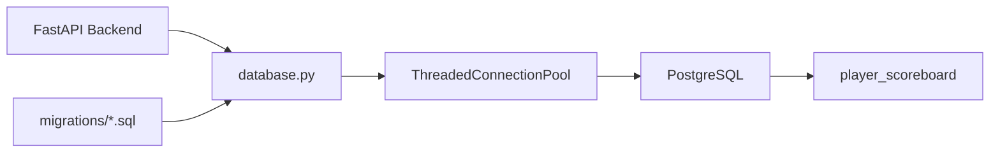

# HexTacTic Database Layer

The HexTacTic persistence layer uses **PostgreSQL** to store durable player progression and match statistics. Database access is isolated behind `database.py`, while schema changes are managed through ordered SQL migrations.

The database deliberately stores player history rather than live game state. Active games remain in the application session manager and are therefore independent from the persistent scoreboard.

> **Scope:** This document covers PostgreSQL architecture, schema, connection pooling, migrations and persistence operations.  
> Application/API behavior is documented in `HexTacTic_README.md`.

---

## Architecture



---

## Responsibilities

The database subsystem provides five primary responsibilities:

1. PostgreSQL connection management.
2. Connection pooling.
3. Schema migration execution.
4. Player-statistic reads.
5. Atomic player-record updates.

It does **not** manage live board state.

---

## Technology

| Layer | Technology |
|---|---|
| Database | PostgreSQL |
| Python driver | `psycopg2` |
| Connection pool | `ThreadedConnectionPool` |
| Result format | `RealDictCursor` |
| Schema management | Ordered SQL migrations |
| Primary persistent entity | `player_scoreboard` |

---

## Schema

The primary table is:

```text
public.player_scoreboard
```

### Columns

| Column | Type | Default / Constraint | Purpose |
|---|---|---|---|
| `id` | `BIGSERIAL` | Primary key | Internal row identifier |
| `username` | `TEXT` | `NOT NULL`, `UNIQUE` | Player identifier |
| `easy_wins` | `INT` | `DEFAULT 0` | Easy-mode wins |
| `easy_losses` | `INT` | `DEFAULT 0` | Easy-mode losses |
| `easy_draws` | `INT` | `DEFAULT 0` | Easy-mode draws |
| `normal_wins` | `INT` | `DEFAULT 0` | Normal-mode wins |
| `normal_losses` | `INT` | `DEFAULT 0` | Normal-mode losses |
| `normal_draws` | `INT` | `DEFAULT 0` | Normal-mode draws |
| `medium_wins` | `INT` | `DEFAULT 0` | Legacy Medium-mode wins |
| `medium_losses` | `INT` | `DEFAULT 0` | Legacy Medium-mode losses |
| `medium_draws` | `INT` | `DEFAULT 0` | Legacy Medium-mode draws |
| `hard_wins` | `INT` | `DEFAULT 0` | Hard-mode wins |
| `hard_losses` | `INT` | `DEFAULT 0` | Hard-mode losses |
| `hard_draws` | `INT` | `DEFAULT 0` | Hard-mode draws |
| `nightmare_wins` | `INT` | `DEFAULT 0` | Nightmare-mode wins |
| `nightmare_losses` | `INT` | `DEFAULT 0` | Nightmare-mode losses |
| `nightmare_draws` | `INT` | `DEFAULT 0` | Nightmare-mode draws |
| `highest_difficulty` | `TEXT` | `DEFAULT 'Easy'` | Highest difficulty reached |
| `last_updated` | `TIMESTAMPTZ` | `DEFAULT NOW()` | Last record update |

The schema is created by `migrations/001_initial.sql`.

---

## Why Statistics Are Difficulty-Specific

Rather than storing only aggregate wins and losses, the scoreboard keeps separate counters for each difficulty tier.

This allows the application to distinguish:

```text
Easy
Normal
Medium
Hard
Nightmare
```

and maintain progression independently for each tier.

The `highest_difficulty` field provides a compact progression indicator used by the application when determining whether Nightmare should be available.

---

## Difficulty Progression

Difficulty ranking is defined in `database.py`:

```text
Easy      → 0
Normal    → 1
Hard      → 2
Nightmare → 3
```

When a match is recorded, the database layer compares the played difficulty against the player's existing highest difficulty.

The stored value is advanced only when the new difficulty has a higher rank.

---

## Legacy Medium Handling

The database schema contains `medium_*` columns because the project previously represented a Medium tier.

The application-level difficulty normalization maps:

```text
Medium → Normal
```

This allows legacy database statistics to remain available while the active application exposes:

```text
Easy
Normal
Hard
Nightmare
```

Migration `002_backfill_highest_difficulty.sql` also treats historical Medium activity as Normal-level activity when reconstructing `highest_difficulty`.

---

## Connection Management

`database.py` uses:

```python
psycopg2.pool.ThreadedConnectionPool
```

The pool is initialized lazily and configured through:

```text
DB_POOL_MIN
DB_POOL_MAX
```

Default values are:

```text
minimum connections: 1
maximum connections: 10
```

Connections are acquired through the `get_connection()` context manager and returned to the pool automatically.

This avoids opening a new PostgreSQL connection for every request.

---

## Connection Configuration

The following environment variables control PostgreSQL connectivity:

```text
DB_NAME
DB_USER
DB_PASSWORD
DB_HOST
DB_PORT
DB_CONNECT_TIMEOUT
DB_POOL_MIN
DB_POOL_MAX
```

Example:

```env
DB_NAME=postgres
DB_USER=postgres
DB_PASSWORD=your_password
DB_HOST=127.0.0.1
DB_PORT=5432
DB_CONNECT_TIMEOUT=5
DB_POOL_MIN=1
DB_POOL_MAX=10
```

`DB_PASSWORD` is mandatory. The database layer raises an error if it is not supplied.

Secrets should never be committed to source control.

---

## Migration System

Database initialization is handled through:

```python
init_db()
```

which performs:

```text
init_pool()
    ↓
run_migrations()
```

The migration runner:

1. Discovers SQL files under `migrations/`.
2. Sorts them by filename.
3. Creates `public.schema_migrations` if necessary.
4. Checks whether each migration has already been applied.
5. Executes unapplied migrations.
6. Records the filename and application timestamp.

This gives the database layer a lightweight migration history without requiring an external ORM migration framework.

---

## Migration History

### `001_initial.sql`

Creates:

```text
public.player_scoreboard
```

with all difficulty-specific counters and progression metadata.

### `002_backfill_highest_difficulty.sql`

Reconstructs `highest_difficulty` for legacy rows based on historical match activity:

```text
Nightmare activity → Nightmare
Hard activity      → Hard
Normal/Medium      → Normal
otherwise          → Easy
```

---

## Player Read Path

The application retrieves a player's statistics through:

```text
GET /api/player/{username}
```

The backend calls:

```python
get_player_stats(username)
```

which executes a parameterized query:

```sql
SELECT *
FROM public.player_scoreboard
WHERE username = %s;
```

If the player exists, the complete row is returned as a dictionary.

Otherwise:

```json
{
  "message": "Player record not found"
}
```

is returned to the application layer.

---

## Player Write Path

Completed system matches are recorded through:

```text
POST /api/record-match
```

The backend delegates to:

```python
update_player_record(username, difficulty, result)
```

The database layer:

1. Normalizes the difficulty.
2. Normalizes the match result.
3. Maps the result to its difficulty-specific column.
4. Reads the current highest difficulty.
5. Resolves the new highest difficulty.
6. Performs an `INSERT ... ON CONFLICT DO UPDATE`.
7. Updates `last_updated`.
8. Returns the updated player row.

---

## UPSERT Strategy

The persistence operation is intentionally idempotent at the player-record level.

For a new player:

```text
INSERT player
```

For an existing player:

```text
ON CONFLICT(username)
DO UPDATE
```

The relevant result counter is incremented rather than replacing the player's previous statistics.

Conceptually:

```sql
INSERT INTO player_scoreboard (...)
VALUES (...)
ON CONFLICT (username)
DO UPDATE SET
    <difficulty_result_counter>
        = player_scoreboard.<difficulty_result_counter> + 1,
    highest_difficulty = ...,
    last_updated = NOW();
```

The actual implementation dynamically determines the appropriate statistics column after validating the difficulty and result.

---

## Result Normalization

The database layer recognizes:

```text
win
loss
draw
```

and maps them to:

```text
wins
losses
draws
```

The API layer additionally accepts pluralized forms used by the frontend:

```text
wins
losses
draws
```

This keeps the persistence implementation focused on a canonical internal representation.

---

## Database Health

The backend exposes:

```text
GET /health
```

which invokes:

```python
ping_database()
```

The database health check executes:

```sql
SELECT 1;
```

A successful query indicates that a pooled PostgreSQL connection can be acquired and used.

---

## Startup and Shutdown

The HexTacTic FastAPI lifespan manages the database lifecycle.

### Startup

```text
FastAPI startup
      ↓
init_db()
      ↓
Initialize connection pool
      ↓
Run pending migrations
```

### Shutdown

```text
FastAPI shutdown
      ↓
close_pool()
      ↓
Close all pooled connections
```

This keeps database resources tied to the application lifecycle.

---

## Security Considerations

The database layer uses parameterized SQL for player-controlled values such as usernames.

Database credentials are loaded from environment configuration rather than hard-coded into queries.

Recommended deployment practices include:

- Do not expose PostgreSQL directly to the public internet.
- Use a dedicated application database user.
- Restrict database network access to the application host/network.
- Store `DB_PASSWORD` in environment or secret-management infrastructure.
- Back up the PostgreSQL database before destructive schema changes.
- Keep migration files under version control.

---

## Repository Structure

```text
python_tictactoe/
├── database.py
├── settings.py
└── migrations/
    ├── 001_initial.sql
    └── 002_backfill_highest_difficulty.sql
```

---

## Example Queries

### Fetch a player

```sql
SELECT *
FROM public.player_scoreboard
WHERE username = 'player1';
```

### Inspect progression

```sql
SELECT
    username,
    highest_difficulty,
    easy_wins,
    normal_wins,
    hard_wins,
    nightmare_wins,
    last_updated
FROM public.player_scoreboard
ORDER BY last_updated DESC;
```

### Inspect migration history

```sql
SELECT *
FROM public.schema_migrations
ORDER BY applied_at;
```

---

## Data Ownership

The system deliberately separates two classes of state:

| State | Storage | Lifetime |
|---|---|---|
| Active board | `GameSessionManager` | Session lifetime |
| Current player/turn | Game session | Session lifetime |
| Current score | Game session | Session lifetime |
| Player statistics | PostgreSQL | Persistent |
| Difficulty progression | PostgreSQL | Persistent |
| Neural-network weights | Model artifact | Persistent deployment artifact |

The database therefore functions as the **historical player-progression layer**, not the live game-state store.

---

## Related Documentation

- `HexTacTic_README.md` — API, frontend, backend and runtime architecture.
- `Mimika_README.md` — AI model and reinforcement-learning subsystem.

---

## Operational Notes

The current repository uses PostgreSQL with migrations and connection pooling. This supersedes older documentation that described a SQLite-backed scoreboard.

The schema contains legacy Medium-specific counters even though the current application normalizes Medium to Normal. These fields should be retained unless a deliberate schema cleanup/migration is introduced.

For production operation, backup strategy, PostgreSQL monitoring and credential management should be treated as infrastructure concerns rather than responsibilities of `database.py`.
