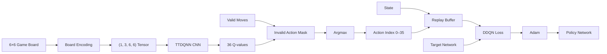

# Mimika

**Mimika** is the reinforcement-learning subsystem behind HexTacTic's system opponent. It implements a convolutional **Double Deep Q-Network (DDQN)** called `TTDQNN`, trained for a 6×6 board and exposed to the application through the `GridScaleAI` inference service.

Mimika separates offline learning from online gameplay: training updates the neural network parameters, while the deployed application loads the resulting weights once and performs inference during live games.

> **Scope:** This document covers Mimika's model architecture, state representation, DDQN training pipeline, action selection and inference service.  
> HexTacTic application integration is documented separately.

---

## Architecture



---

## What Mimika Does

At inference time, Mimika receives:

- The current 6×6 board.
- The player marker whose turn it is.
- The legal action indices.
- The selected difficulty.

It then chooses either:

1. A random legal action, according to the difficulty's exploration probability; or
2. The highest-valued legal action predicted by the trained TTDQNN.

The model never directly writes to the game board. It returns an action index to the FastAPI backend, which converts that index into board coordinates and applies the move through the game engine.

---

## Model Architecture

`mimika/model.py` defines `TTDQNN`.

```text
Input
(1, 3, 6, 6)

      ↓

Conv2d
3 → 32 channels
3×3 kernel
padding=1
ReLU

      ↓

Conv2d
32 → 64 channels
3×3 kernel
padding=1
ReLU

      ↓

Flatten
64 × 6 × 6 = 2304

      ↓

Linear
2304 → 128
ReLU

      ↓

Linear
128 → 36

      ↓

36 Q-values
```

The 36 output values correspond to the 36 possible cells on the 6×6 board.

---

## State Representation

Mimika converts the symbolic game board into a three-plane tensor.

### Input channels

| Channel | Representation |
|---|---|
| 0 | Empty cells |
| 1 | Current player's pieces |
| 2 | Opponent's pieces |

The resulting tensor has shape:

```text
(1, 3, 6, 6)
```

This representation gives the CNN explicit spatial information while avoiding dependence on the textual `X`/`O` representation used by the game engine.

The same board encoder is shared between training and inference.

---

## Action Representation

Every cell maps to a flattened action index:

```text
index = row × 6 + column
```

Therefore:

```text
0 ... 35
```

represent the complete action space.

For example:

```text
(0, 0) → 0
(0, 1) → 1
...
(5, 5) → 35
```

`valid_move_indices()` produces only currently empty cells.

---

## Invalid Action Masking

The network always produces 36 Q-values, even when many cells are occupied.

Before selecting an action, Mimika creates a masked Q-value vector:

```text
valid cell    → original Q-value
invalid cell  → -∞
```

Then:

```python
np.argmax(q_mask)
```

is used to select the action.

This guarantees that an occupied cell cannot win the final `argmax` selection.

---

## Difficulty Scaling

Difficulty is implemented at the inference layer rather than by maintaining separate neural networks.

Current optimal-play probabilities are:

| Difficulty | Probability of using model-optimal action |
|---|---:|
| Easy | 30% |
| Normal | 70% |
| Hard | 90% |
| Nightmare | 100% |

When the optimal branch is not selected, Mimika chooses uniformly from the valid moves.

This creates progressively stronger opponents without changing the underlying network.

### Important distinction

Difficulty is therefore **not equivalent to model quality**.

The same trained network can produce four gameplay experiences because the inference policy changes how often its highest-valued action is used.

---

## Inference Service

`mimika/ai_service.py` provides:

```python
GridScaleAI
```

The service:

1. Determines CPU/GPU availability.
2. Instantiates `TTDQNN`.
3. Loads `dqn_model_weights.pth`.
4. Switches the model to evaluation mode.
5. Encodes incoming board states.
6. Performs the forward pass.
7. Masks invalid actions.
8. Returns the selected action index.

The service is instantiated once during FastAPI startup and retained in memory.

If the weight artifact cannot be found, the service remains available but falls back to random legal moves.

---

## Public Inference Interface

The main integration point is:

```python
get_best_move(
    current_moves,
    player_char,
    valid_moves,
    difficulty
) -> action_index
```

The backend uses this interface whenever:

- The AI must make the opening move.
- A human move completes without ending the match.
- The system player becomes the active player.

---

## DDQN Training

Mimika also contains an offline training implementation.

### Agent

`mimika/agent.py` defines `DQNAgent`.

It maintains:

- A replay buffer.
- A policy network.
- A target network.
- An Adam optimizer.
- An epsilon exploration value.

The policy and target networks share the same `TTDQNN` architecture.

---

## Replay Buffer

Training experiences are stored as:

```text
(state, action, reward, next_state, done)
```

The replay memory has a configured maximum capacity of:

```text
50,000 transitions
```

A batch is sampled only after at least 64 experiences are available.

---

## Double-DQN Target

The training update separates action selection from action evaluation.

The policy network selects the next action:

```text
a* = argmax Q_policy(s', a)
```

The target network evaluates that selected action:

```text
Q_target(s', a*)
```

The target is then formed as:

```text
Target Q =
reward + γ × Q_target(s', a*) × (1 - done)
```

with:

```text
γ = 0.99
```

The predicted Q-value for the taken action is compared against the target using mean squared error.

---

## Optimization

Training uses:

- Adam optimizer.
- Learning rate: `0.001`
- Batch size: `64`
- MSE loss.
- Gradient clipping with maximum norm `1.0`.
- Target-network synchronization every `1000` training steps.

The target network is initialized from the policy network and periodically synchronized.

---

## Exploration

Training uses epsilon-greedy exploration.

| Parameter | Value |
|---|---:|
| Initial epsilon | `1.0` |
| Minimum epsilon | `0.05` |
| Decay | `0.995` |

The training agent therefore begins by heavily favoring random exploration and gradually shifts toward policy-network actions.

---

## Reward Structure

The trainer assigns a per-step reward:

```text
step_reward = -0.1 + (points_gained × 10.0)
```

Terminal rewards are:

```text
Winning player: +30
Losing player:  -30
Draw:             0
```

The reward system therefore combines:

- A small step penalty.
- Positive reward for scoring combinations.
- A strong terminal reward for winning.
- A strong terminal penalty for losing.

---

## Training Procedure

`mimika/trainer.py` provides the training loop.

The default training function is:

```python
train(episodes=10000)
```

At a high level:

```text
Initialize environment
        ↓
Initialize DQNAgent
        ↓
Create new game
        ↓
Encode current state
        ↓
Choose epsilon-greedy action
        ↓
Apply action
        ↓
Calculate reward
        ↓
Store transition
        ↓
Replay update
        ↓
Periodically synchronize target network
        ↓
End episode
        ↓
Decay epsilon
        ↓
Periodically save weights
```

Weights are saved under:

```text
saved_models/dqn_model_weights.pth
```

The deployed application can use the corresponding model artifact through the configured `MODEL_PATH`.

---

## Configuration

`mimika/config.py` contains:

```python
BOARD_SIZE = 6
IP_CHANNELS = 3

LR = 0.001
GAMMA = 0.99
BATCH_SIZE = 64
MEMORY_SIZE = 50000

EPS_START = 1.0
EPS_MIN = 0.05
EPS_DECAY = 0.995

TARGET_UPD_FREQ = 1000
```

These parameters define the core training configuration.

---

## Hardware

The implementation automatically selects:

```text
CUDA → if available
CPU  → otherwise
```

Training can therefore use a CUDA-capable GPU when available.

Inference is lightweight enough for CPU execution because the deployed network contains only two convolutional layers and two fully connected layers.

---

## File Structure

```text
mimika/
├── __init__.py
├── agent.py
├── ai_service.py
├── board_encoding.py
├── config.py
├── model.py
├── trainer.py
└── dqn_model_weights.pth
```

### Responsibilities

| File | Responsibility |
|---|---|
| `model.py` | TTDQNN neural network |
| `board_encoding.py` | State representation and legal-action extraction |
| `config.py` | Model/training hyperparameters |
| `agent.py` | DDQN agent and replay update |
| `trainer.py` | Offline training loop |
| `ai_service.py` | Production inference wrapper |
| `dqn_model_weights.pth` | Trained model parameters |

---

## Deployment Lifecycle

Mimika is loaded as part of the FastAPI lifespan:

```text
FastAPI startup
      ↓
GridScaleAI()
      ↓
TTDQNN()
      ↓
Load model weights
      ↓
model.eval()
      ↓
Ready for inference
```

This avoids repeatedly constructing the neural network for individual moves.

---

## Relationship with HexTacTic

The boundary between the two systems is intentionally narrow:

```text
HexTacTic
   │
   │ current board + player + legal actions + difficulty
   ▼
GridScaleAI
   │
   │ selected action index
   ▼
HexTacTic Rules Engine
```

Mimika does not own:

- Game sessions.
- Player statistics.
- HTTP routing.
- Database persistence.
- Final game-state arbitration.

Those responsibilities belong to HexTacTic.

---

## Reproducibility

For reproducible training experiments, record:

- Number of episodes.
- Hyperparameter configuration.
- Model checkpoint.
- Random seeds, if introduced.
- Training device.
- Training loss.
- Win/draw/loss statistics.

The current trainer saves checkpoints every 500 episodes and at the end of training.

---

## Related Documentation

- `HexTacTic_README.md` — application architecture and API integration.
- `Database_README.md` — PostgreSQL persistence layer.

---

## Implementation Notes

The architecture diagram describes the DDQN training components accurately at a conceptual level. The repository additionally contains concrete implementations in `agent.py` and `trainer.py`, so the training pipeline is not merely theoretical.

One implementation detail worth preserving in future changes is the distinction between **training exploration** (`epsilon`) and **runtime difficulty scaling** (the difficulty-specific optimal-action probability). They solve different problems and should not be conflated.
